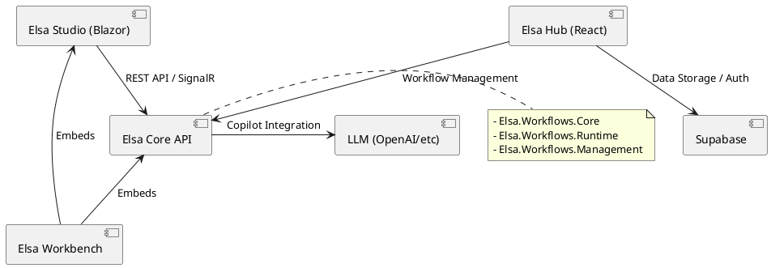

# Elsa 시스템 아키텍처 개요 (01_Elsa_System_Architecture.md)

이 문서는 Elsa 에코시스템의 전체적인 고수준 아키텍처를 설명합니다. Elsa는 분산 환경에서 워크플로를 설계하고 실행하기 위한 강력한 닷넷 기반 프레임워크입니다.

## 1. 주요 프로젝트 구성

Elsa 에코시스템은 다음과 같은 주요 프로젝트들로 구성됩니다:

- **elsa-core**: 워크플로의 핵심 엔진입니다. 활동(Activity)의 정의, 워크플로 실행 logic, 런타임 관리, API 엔드포인트를 포함합니다.
- **elsa-studio**: Blazor 기반의 모듈형 관리 도구입니다. 워크플로를 시각적으로 설계하고, 실행 중인 인스턴스를 모니터링할 수 있는 UI를 제공합니다.
- **elsa-hub**: React, Vite, Tailwind, Supabase를 기반으로 한 현대적인 관리 포털입니다. 대규모 사용자 관리 및 협업 기능을 강화한 대안 UI입니다.
- **elsa-copilot**: LLM(대형 언어 모델)을 통합하여 자연어로 워크플로를 생성하거나 분석하는 AI 보조 도구입니다.
- **elsa-workbench**: Elsa Server와 Elsa Studio를 하나로 통합하여 즉시 실행 가능한 형태의 호스트 프로젝트입니다.

## 2. 시스템 상호작용 다이어그램

각 컴포넌트 간의 상호작용은 다음과 같습니다.

## 3. 핵심 아키텍처 특징

1.  **분리된 실행 모델**: 워크플로 정의(Management)와 실제 실행(Runtime)이 분리되어 있어 확장이 용이합니다.
2.  **모듈형 UI**: Elsa Studio는 Blazor의 특성을 살려 기능을 기능(Feature) 단위로 조립할 수 있는 플러그인 아키텍처를 가집니다.
3.  **데이터 스토리지 유연성**: EF Core, MongoDB, Dapper 등 다양한 데이터 지속성 레이어를 지원합니다.
