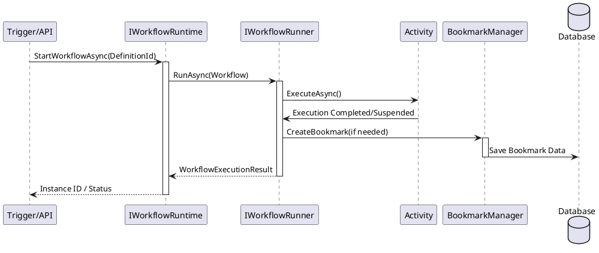

# Elsa 코어 엔진 아키텍처 (02_Elsa_Core_Engine_Architecture.md)

Elsa 워크플로 엔진은 Elsa 에코시스템의 심장부로, 워크플로의 생명 주기를 관리하고 실행하는 역할을 담당합니다.

## 1. 핵심 모듈 구성

Elsa Core는 다음과 같은 네 가지 주요 모듈로 나뉩니다:

1.  **Elsa.Workflows.Core**: 워크플로의 기본 빌딩 블록인 활동(Activity), 변수(Variable), 표현식(Expression)의 기본 구조를 정의합니다.
2.  **Elsa.Workflows.Runtime**: 워크플로를 실제로 실행하고 인스턴스를 관리합니다. 북마크(Bookmark)를 통한 실행 중단 및 재개 기능을 제공합니다.
3.  **Elsa.Workflows.Management**: 워크플로 정의(Definition)의 영속성 관리, 버전 관리, 대시보드를 위한 관리 기능을 담당합니다.
4.  **Elsa.Workflows.Api**: 외부 시스템에서 워크플로 엔진에 접근할 수 있도록 REST API 엔드포인트를 제공합니다.

## 2. 워크플로 실행 흐름 (Sequence Diagram)

워크플로가 트리거되어 실행되고, 외부 이벤트를 기다리기 위해 북마크를 생성하는 과정은 다음과 같습니다.

## 3. 지속성 및 북마크 전략

- **Persistence**: 워크플로 상태(Workflow State)는 JSON 형태로 직렬화되어 데이터베이스에 저장됩니다.
- **Bookmarking**: 비동기 작업(예: HTTP 대기, 사용자 승인)이 필요할 때 엔진은 '북마크'를 생성하고 실행을 중지합니다. 나중에 특정 이벤트가 발생하면 해당 북마크를 찾아 워크플로를 다시 시작합니다.
