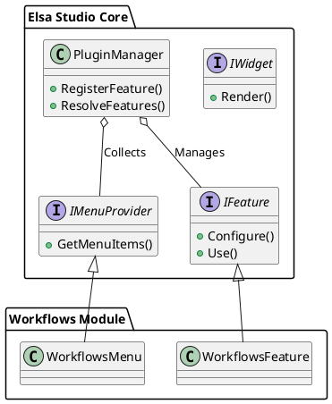

# Elsa UI 및 포털 아키텍처 (03_Elsa_UI_and_Portal_Architecture.md)

Elsa는 사용자가 워크플로를 관리하고 설계할 수 있도록 두 가지 주요 UI 플랫폼을 제공합니다: Elsa Studio와 Elsa Hub입니다.

## 1. Elsa Studio (Blazor 기반)

Elsa Studio는 닷넷 개발자들에게 친숙한 Blazor 기술을 사용하여 구축된 강력한 관리 도구입니다.

- **특징**: 강력한 확장성, 강력한 형식(Strongly-typed) 개발 환경.
- **모듈화**: `IFeature` 인터페이스를 통해 기능을 확장합니다. 예를 들어, `WorkflowsModule`은 워크플로 편집 기능을, `LabelsModule`은 레이블 관리 기능을 추가합니다.
- **FlowchartDesigner**: 다이어그램 기반으로 워크플로를 시각적으로 설계할 수 있는 전용 에디터를 포함합니다.

## 2. Elsa Hub (React 기반)

Elsa Hub는 보다 현대적인 프론트엔드 스택을 선호하는 환경을 위한 대안 포털입니다.

- **스택**: React, Vite, Tailwind CSS, Supabase.
- **장점**: 빠른 UI 반응성, Supabase를 통한 강력한 인증 및 실시간 데이터 처리 능력.

## 3. Studio의 플러그인 아키텍처

Elsa Studio는 런타임에 기능을 동적으로 구성할 수 있는 구조를 가지고 있습니다.

## 4. 비교 요약

| 구분 | Elsa Studio | Elsa Hub |
| :--- | :--- | :--- |
| **기반 기술** | Blazor Server / WASM | React / Vite |
| **언어** | C# | TypeScript / JavaScript |
| **주요 목적** | 고기능 워크플로 설계 및 디버깅 | 사용자 친화적 포털 및 협업 |
| **확장 방식** | C# Feature / Plugin | React Components |
