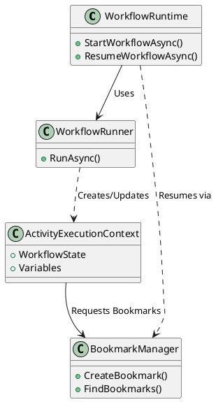

# Elsa 주요 코드 심층 분석 (04_Elsa_Important_Code_Deep_Dive.md)

이 문서는 Elsa 프레임워크를 구성하는 핵심 클래스들의 코드 수준 분석과 이들 간의 상호작용을 다룹니다.

## 1. 핵심 실행 엔진 (Core Logic)

### WorkflowRunner
`WorkflowRunner`는 워크플로 실행의 최저 레벨 엔진입니다.
- **역할**: 워크플로 그래프를 순회하며 각 `Activity`를 실행합니다.
- **특징**: `ActivityExecutionContext`를 생성하여 실행 상태를 추적하며, 워크플로의 실행 결과를 `WorkflowExecutionResult`로 반환합니다.

### WorkflowRuntime
`WorkflowRuntime`은 더 높은 수준의 추상화 레이어입니다.
- **역할**: 워크플로 인스턴스의 생성, 시작, 재개를 관리합니다.
- **상호작용**: `WorkflowRunner`를 내부적으로 사용하여 실제 실행을 수행하며, 인스턴스 저장소와 통신하여 상태를 지속시킵니다.

## 2. 실행 및 지속성 (Execution & Persistence)

### BookmarkManager
- **역할**: 워크플로가 일시 중단될 때 생성되는 '북마크'를 관리합니다.
- **기능**: 특정 활동이 대기 상태에 들어갈 때 북마크를 생성하고 데이터베이스에 저장하며, 나중에 외부 자극(Stimulus)이 오면 해당 북마크를 찾아 워크플로를 다시 깨웁니다.

## 3. Studio 프레임워크 (Studio Framework)

### IFeature & ModuleBase
Elsa Studio의 모든 기능은 `IFeature`를 기반으로 합니다.
- **구조**: `AddWorkflowsModule()`과 같은 확장 메서드를 통해 서비스 컨테이너에 등록되며, 각 모듈은 메뉴 항목, 위젯, 대시보드 타일 등을 시스템에 주입합니다.

### WorkflowDesigner
- **역할**: Blazor 컴포넌트로 구현된 시각적 디자이너입니다.
- **특징**: Flowchart 엔진을 사용하여 활동들을 드래그 앤 드롭으로 배치하고 연결할 수 있게 하며, 최종적으로 이를 Elsa가 이해할 수 있는 JSON 정의로 변환합니다.

## 4. 클래스 관계도

이러한 클래스들의 유기적인 결합을 통해 Elsa는 복잡한 비즈니스 프로세스를 안정적으로 처리할 수 있습니다.
