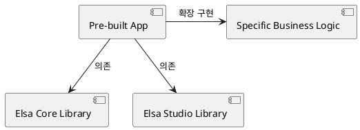

# Elsa Apps 기술 개요 및 아키텍처

Elsa Apps는 특정 산업군이나 사용 사례에 맞게 사전 구성된 애플리케이션 템플릿 및 구현체 모음입니다.

## 역할
- **빠른 시작**: 복잡한 설정 없이 즉시 실행 가능한 도커 기반 또는 솔루션 기반 앱 제공.
- **참조 아키텍처**: 실제 서비스에 Elsa를 어떻게 통합해야 하는지에 대한 표준 예시.
- **커스터마이징**: 기본 앱을 복제하여 비즈니스 특화 기능을 추가할 수 있는 베이스라인.

## 구조 다이어그램
