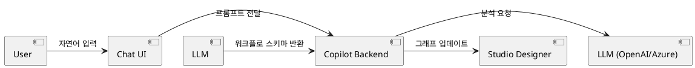

# Elsa Copilot 기술 개요 및 아키텍처

Elsa Copilot은 대규모 언어 모델(LLM)을 활용하여 워크플로 설계 및 관리를 지원하는 AI 보조 도구입니다.

## 아키텍처 특징
- **자연어 처리**: 사용자의 자연어 요청을 해석하여 워크플로 정의(JSON)로 변환.
- **지능형 추천**: 워크플로 작성 중 다음에 올 활동이나 설정을 추천.
- **채팅 인터페이스**: Studio 내에서 대화형으로 워크플로를 수정하고 질의응답 수행.

## AI 연동 흐름
