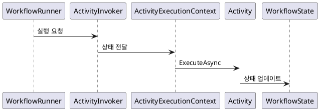

# Elsa Core 기술 개요 및 아키텍처

Elsa Core는 .NET으로 구축된 강력한 워크플로 엔진으로, 복잡한 비즈니스 로직을 실행 가능한 워크플로로 추상화합니다.

## 아키텍처 개요
Elsa Core는 모듈형 아키텍처를 채택하고 있으며, `Elsa.Workflows.Core`를 중심으로 실행 모델, 활동(Activity) 정의, 상태 관리를 담당합니다. `Elsa.Workflows.Runtime`은 워크플로의 영속성과 실행 스케줄링을 관리합니다.

## 구성 요소 간 관계
- **Core**: 활동 실행 및 상태 추출의 핵심 로직 제공.
- **Runtime**: 데이터베이스 영속성 및 분산 실행 관리.
- **Management**: 워크플로 정의 저장 및 API 제공.

## 데이터 흐름 다이어그램
