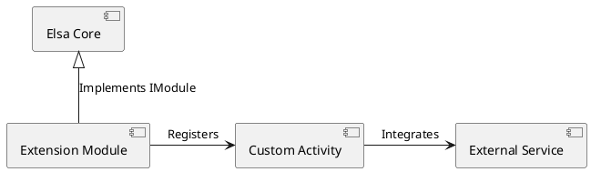

# Elsa Extensions 기술 개요 및 아키텍처

Elsa Extensions는 Elsa 엔진의 기능을 확장하는 공식 및 커뮤니티 활동(Activity)과 서비스들의 집합입니다.

## 확장 모델
- **Activity Packs**: HTTP, Email, SQL, RabbitMQ 등 외부 시스템 연동을 위한 활동 모음.
- **Persistence Providers**: Entity Framework Core, Dapper, MongoDB 등 다양한 데이터 저장소 지원.
- **Identity & Auth**: OAuth2, OpenID Connect 등 인증 프로바이더 확장.

## 아키텍처 구조
