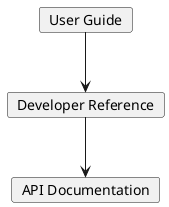

# Elsa Gitbook 기술 개요 및 문서화 전략

Elsa Gitbook은 Gitbook 플랫폼을 통해 제공되는 공식 사용자 문서 및 API 레퍼런스의 소스입니다.

## 특징
- **버전 관리**: 코드와 문서의 동기화를 위해 Git 기반으로 관리.
- **검색 최적화**: 사용자가 필요한 기능을 빠르게 찾을 수 있도록 인덱싱 제공.
- **다국어 지원**: 글로벌 커뮤니티를 위한 다국어 번역 구조(준비 중).

## 문서 계층
