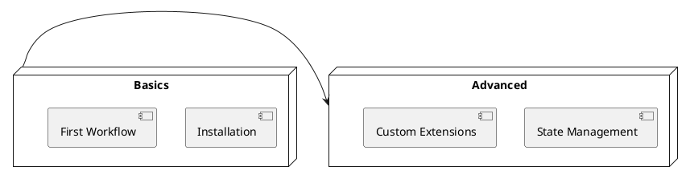

# Elsa Guides 기술 개요 및 콘텐츠 구조

Elsa Guides는 개념적 설명부터 튜토리얼까지 포괄하는 개발자 가이드 문서 모음입니다.

## 주요 구조
- **Getting Started**: 설치 및 첫 번째 워크플로 작성 가이드.
- **Core Concepts**: 변수, 활동, 영속성 등 엔진 핵심 개념 설명.
- **Best Practices**: 성능 최적화, 보안, 유지보수 전략 제안.

## 지식 맵
