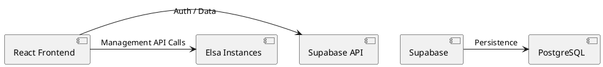

# Elsa Hub 기술 개요 및 아키텍처

Elsa Hub는 React와 Supabase를 기반으로 구축된 현대적인 관리 포털이자 SaaS 레이어입니다.

## 주요 기능
- **테넌트 관리**: 여러 Elsa 인스턴스와 조직을 중앙에서 관리.
- **사용자 프로필 및 권한**: Supabase Auth를 연동한 세밀한 접근 제어.
- **대시보드**: 전체 워크플로 실행 상태 및 통계 시각화.

## 아키텍처 구조
