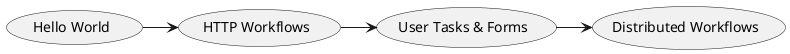

# Elsa Samples 기술 개요 및 아키텍처

Elsa Samples는 개발자들이 Elsa의 다양한 기능을 학습하고 실제 프로젝트에 적용할 수 있도록 돕는 예제 코드 저장소입니다.

## 주요 카테고리
- **Console Apps**: 가장 단순한 형태의 워크플로 실행 예제.
- **ASP.NET Core Integration**: 웹 API 및 대시보드 통합 예제.
- **Advanced Workflows**: 분기, 루프, 에러 핸들링 등 복잡한 시나리오 구현 예시.

## 학습 경로
