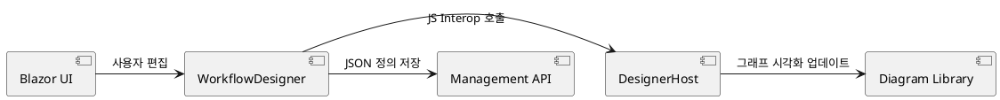

# Elsa Studio 기술 개요 및 아키텍처

Elsa Studio는 Blazor를 기반으로 구축된 현대적인 워크플로 디자이너 및 관리 도구입니다.

## 아키텍처 개요
Blazor WebAssembly 또는 Server 모드에서 동작하며, `IFeature` 인터페이스를 통한 모듈화된 플러그인 시스템을 갖추고 있습니다. 이를 통해 새로운 활동 UI와 대시보드 컴포넌트를 확장할 수 있습니다.

## 시스템 구성
- **Shell**: 전체 레이아웃, 내비게이션, 모듈 로딩 관리.
- **Designer**: X6 또는 시각화 라이브러리를 사용한 드래그 앤 드롭 편집기.
- **Management API Client**: 서버(Core)와의 통신을 위한 추상화 레이어.

## 시각화 데이터 흐름
