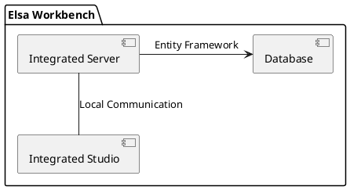

# Elsa Workbench 기술 개요 및 아키텍처

Elsa Workbench는 Elsa 엔진(Server)과 디자인 도구(Studio)를 하나의 통합된 환경으로 제공하는 호스트 프로젝트입니다.

## 역할 및 특징
- **통합 호스팅**: 개발자가 별도의 설정 없이 서버와 UI를 동시에 실행할 수 있는 환경 제공.
- **환경 설정**: 데이터베이스 연결, 인증/인가, 로깅 등의 전역 설정을 중앙 집중화.
- **솔루션 템플릿**: 표준적인 Elsa 애플리케이션의 모범 사례(Best Practice)를 제시.

## 컴포넌트 관계
